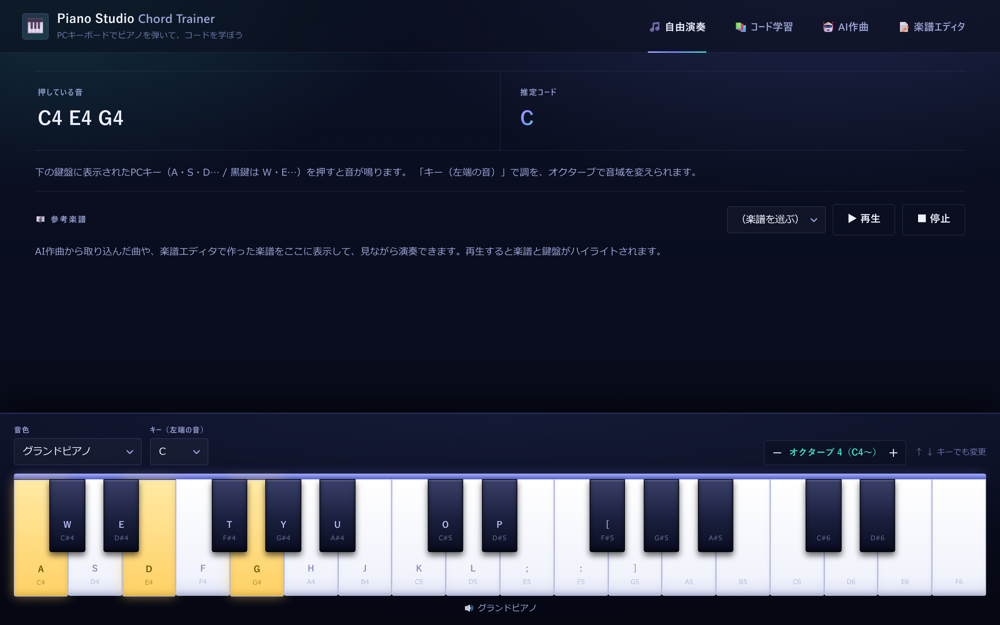
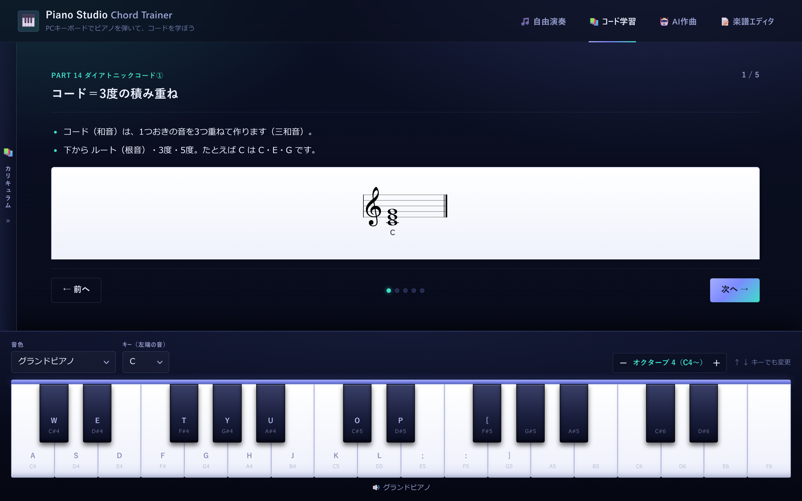
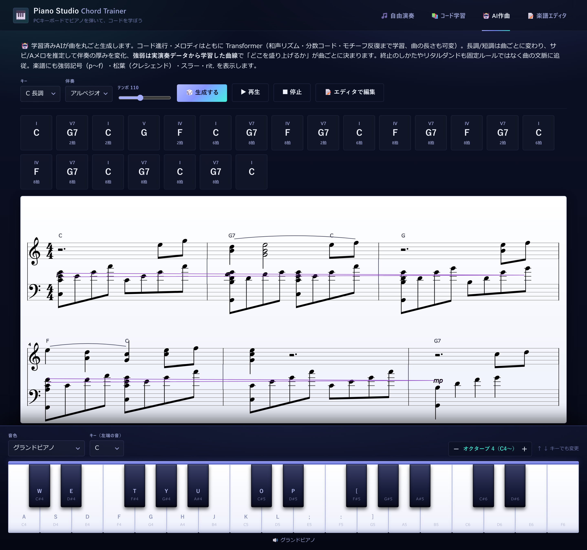
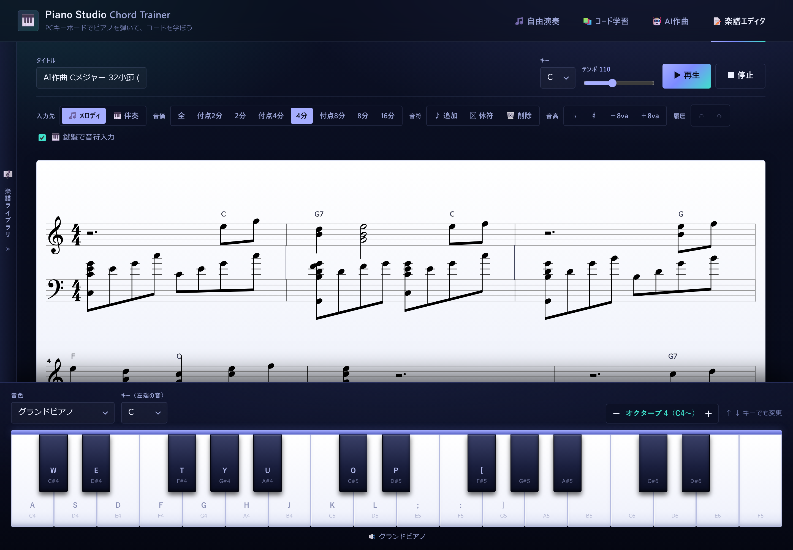

# 作品紹介 — Piano Studio（Keyboard Piano & Chord Trainer）

> PCキーボードがピアノになり、音楽理論を学べて、自作AIが作曲までする——ブラウザだけで完結する音楽学習アプリ

| 項目 | 内容 |
|------|------|
| **デモ** | **https://kosei-matsuzaki.github.io/piano-studio/** （インストール不要・ブラウザでそのまま動作） |
| 形態 | Webアプリ（HTML/CSS/JavaScript、**ビルド不要・`index.html` を開くだけ**） |
| 主要機能 | 自由演奏／音楽理論カリキュラム（全52パート）／AI作曲（自作Transformer）／楽譜エディタ |
| 規模 | アプリ＋学習パイプラインで約9,400行（curriculum.js等のデータ含む）、学習済みモデル約160万パラメータ |
| 使用技術 | Vanilla JS（フレームワーク不使用）、Web Audio（Tone.js）、VexFlow、Python / PyTorch（学習）、**自作ニューラルネット推論エンジン** |

---

## 1. どんなアプリか

「楽器がなくても、ピアノとコード理論を学び始められる」ことを目標にした学習アプリです。

- **🎵 自由演奏** — PCキーボード（A段=白鍵、Q段=黒鍵）で演奏。押した音から**コードを自動判定**して表示します。調を変えると鍵盤全体が実際のピアノと同じ配列で「スライド」するので、どの調でも同じ指の形で弾けます。
- **📚 コード学習** — 準備編／メロディ編／コード編／リズム編の**4章・全52パート**をスライド形式で学習。五線譜・鍵盤ハイライト・リズムグリッド（ドラム音つき）が連動し、学んだ内容はその場で画面下の鍵盤を弾いて練習・判定できます。
- **🤖 AI作曲** — 公開データセットから**自分で学習させた小型ニューラルネット**が、コード進行→メロディ→強弱を丸ごと生成。生成曲は五線譜（強弱記号・スラー・rit.つき）で表示され、そのまま再生できます。
- **📝 楽譜エディタ** — AI生成曲の取り込み・手直しや、ゼロからの譜面作成。ブラウザに保存でき、自由演奏の「参考楽譜」として表示しながら練習できます。

## 2. スクリーンショット

### 自由演奏 — 押鍵とコード自動判定（C-E-G →「C」と判定）


### コード学習 — 五線譜・鍵盤ハイライト連動のスライド学習（全52パート）


### AI作曲 — コード進行チップと生成された楽譜（強弱記号・スラーも自動付与）


### 楽譜エディタ — 生成曲を取り込んで編集


## 3. 動かし方

```bash
# 方法1: index.html をブラウザ（Chrome/Edge推奨）で開くだけ
# 方法2: ローカルサーバー
python -m http.server 8000   # → http://localhost:8000
```

- インストール・ビルド一切不要（Tone.js / VexFlow / ピアノ音源はCDNから読み込み）
- ブラウザの自動再生制限のため、最初にクリックかキー入力をすると音が有効になります
- AIモデルの再学習を試す場合のみ Python 環境が必要です（[data-pipeline.md](data-pipeline.md) 参照）

## 4. 技術構成

```
ブラウザ（依存: Tone.js / VexFlow のみ、フレームワーク不使用）
index.html — 開くだけで起動
└─ src/
   ├─ piano.js      鍵盤描画・キーマッピング・発音（調に応じて鍵盤自体を再構成）
   ├─ music.js      音楽理論エンジン（音名・コード判定・移調）
   ├─ curriculum.js 全52パートのカリキュラムデータ（docs/curriculum.md が正本）
   ├─ modes.js      自由演奏・コード学習のロジック（練習判定・スライド描画）
   ├─ visuals.js    五線譜（VexFlow）・リズムグリッド描画
   ├─ neural.js     ★自作の推論エンジン（Transformer/LSTM、依存ライブラリなし）
   ├─ model.js      ★学習済み重み（約160万パラメータ、JSONで同梱）
   ├─ compose.js    AI作曲UI・伴奏アレンジ・セクション推定・再生
   └─ editor.js     楽譜エディタ（localStorage保存・Undo/Redo・鍵盤入力）

学習側（Python / PyTorch、tools/）
data取得 → 前処理（コード解析・キー推定・ローマ数字化）→ 共通コーパス形式
        → コード進行Transformer / メロディTransformer / 強弱LSTM を学習 → model.js 書き出し
```

### AI作曲の仕組み（3ブロック構成・すべて自作）

1. **コード進行 Transformer**（d=160, 3層4ヘッド）— フル曲のコード進行を1拍単位（保持トークン形式）で学習。「いつコードが変わるか」までモデルが決め、曲の長さも終止トークンまでの可変長。曲構造（反復）が学習から創発する。
2. **メロディ Transformer**（d=128, 3層）— コード・小節内拍位置・フレーズ位置を条件に16分音符単位で生成。トニック相対で正規化して全キー対応。
3. **強弱曲線 LSTM** — POP909の実演奏ベロシティから「曲のどこを盛り上げるか」を学習し、強弱記号（p〜f）・クレシェンドとして楽譜にも反映。

生成品質のため、推論エンジン側に**生成時バイアス**（拍位相・彩り率・音楽理論・休符予算など）を実装し、コード進行の反復を検出してメロディのモチーフを再利用する後処理も行っています。伴奏は生成コードから濁らない声部を組み立てるルールベースのアレンジャーです。

### こだわった点

- **推論エンジンの自作** — TensorFlow.js等を使わず、Transformer（Multi-Head Attention＋KVキャッシュによる自己回帰生成）とLSTMの前向き計算を素のJSで実装。学習側（PyTorch）とはエクスポート時に最大誤差を突き合わせて数値一致を検証。`file://` で開くだけで動く軽さを維持。
- **データパイプラインの整備** — 9種類の公開データセット（MIDI・MusicXML・ABC・.lab注釈）を、コード表記解析・キー推定・ローマ数字化を通して共通コーパス形式に統一。品質検査スクリプトつきで再現可能な形に整理（[data-pipeline.md](data-pipeline.md)）。
- **「鍵盤がスライドする」移調設計** — 調が変わっても指の形が変わらないため、カリキュラム（I-IV-V等）を全キーで同じ操作のまま学べる。カリキュラムのコード名・出題も選んだ調に自動追従。
- **カリキュラムの内製** — 全52パート・約270スライドの解説を書き下ろし、五線譜・鍵盤アニメーション・ドラム音源つきリズムグリッド・弾いて判定する練習を各回に配置。正本（Markdown）と実データ（JS）を分離して保守しやすく。

## 5. 開発における生成AIの利用について

本作品は、AIペアプログラミングツール（Claude Code）を活用して開発しました。

- **自分が行ったこと**：企画・機能の発案、仕様と挙動の決定、アーキテクチャ（2段Transformer＋強弱LSTM、保持トークン形式などのモデル設計方針）の選定、生成結果・学習品質の評価と改善方針の決定、カリキュラム内容の監修、動作確認
- **AIを活用したこと**：上記方針に基づくコードの実装、データセット前処理スクリプトの作成、リファクタリング、ドキュメント整備

<!-- 【要編集】上記の分担は下書きです。実際の開発の進め方に合わせて、ご自身の言葉で正確に調整してください。面接で深掘りされる前提で、誇張のない記述にしておくことを推奨します。 -->

## 6. 使用ライブラリ・データと権利

| 種別 | 名称 | ライセンス等 |
|------|------|--------------|
| ライブラリ | Tone.js | MIT（CDN読み込み） |
| ライブラリ | VexFlow | MIT（CDN読み込み） |
| 音源 | Salamander Grand Piano (Alexander Holm) | CC BY 3.0（Tone.jsホストのCDNから読み込み） |
| 学習データ | POP909 / OpenEWLD / Nottingham / JSB Chorales / McGill Billboard / isophonics ほか | 研究用途で公開されているデータセット。**リポジトリには同梱せず**、取得スクリプトと手順のみ公開 |

- カリキュラムの解説テキストは本アプリのために書き下ろしたものです。理論内容の正確性確認に参照した資料は [curriculum.md](curriculum.md) 末尾の「出典」に記載しています（準備編・メロディ編・リズム編の構成は [SoundQuest](https://soundquest.jp/) を参考にしました）。
- 学習済みモデル（model.js）は研究用途配布のデータセットに由来するため、学習・デモ目的での利用を想定しています。
- 本リポジトリのコードは MIT License です。
